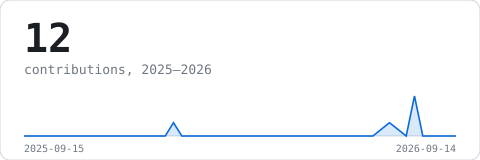
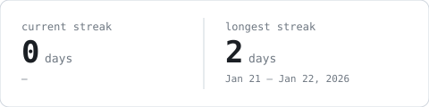
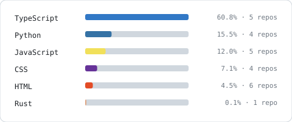
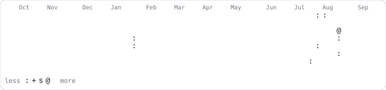

## 🌐 Socials:
  

# 💻 Tech Stack:
   

# 📊 GitHub Stats:

<picture>
  <source media="(prefers-color-scheme: dark)" srcset="assets/stats-dark.svg">
  
</picture>

<picture>
  <source media="(prefers-color-scheme: dark)" srcset="assets/streak-dark.svg">
  
</picture>

<picture>
  <source media="(prefers-color-scheme: dark)" srcset="assets/langs-dark.svg">
  
</picture>

<picture>
  <source media="(prefers-color-scheme: dark)" srcset="assets/year-dark.svg">
  
</picture>

Generated nightly by <a href="scripts/generate_stats.py">scripts/generate_stats.py</a> — no third-party widgets, no external requests.
